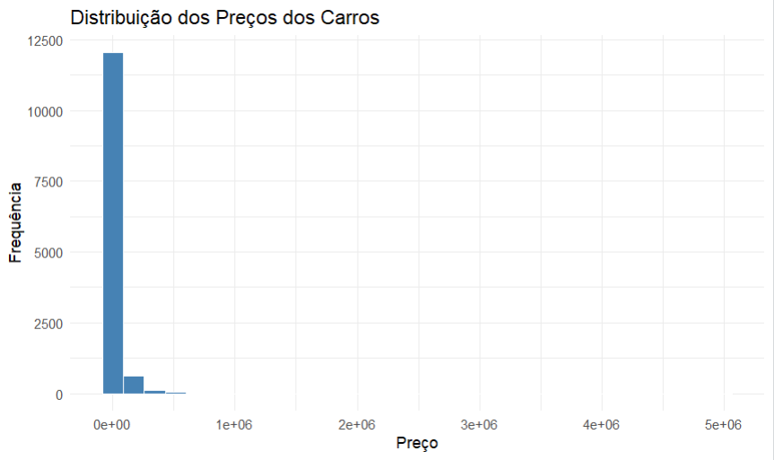
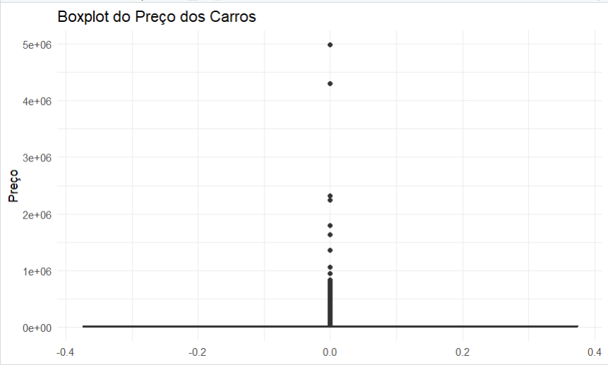
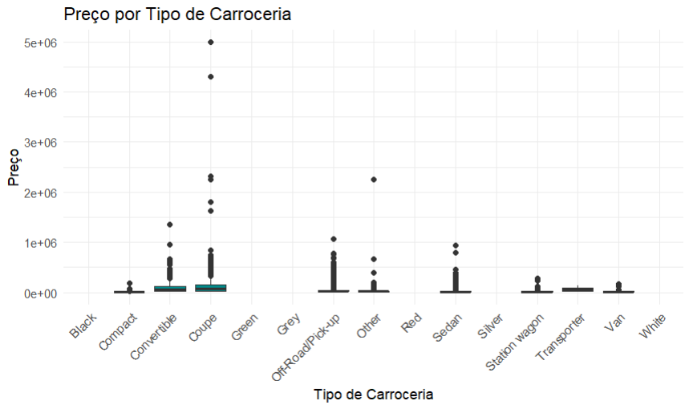
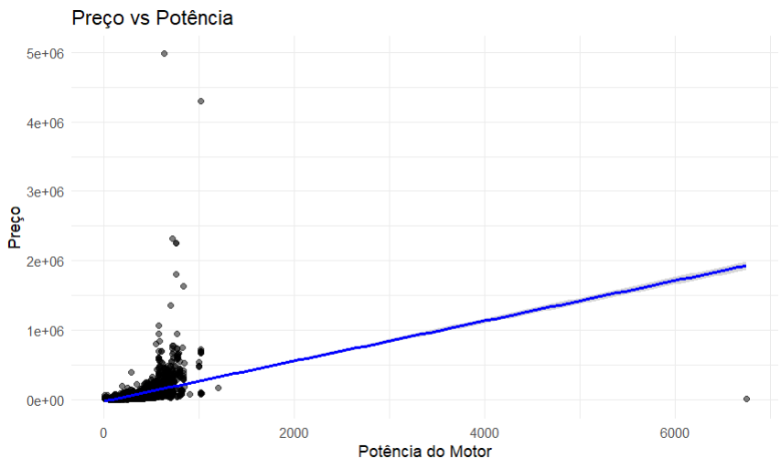
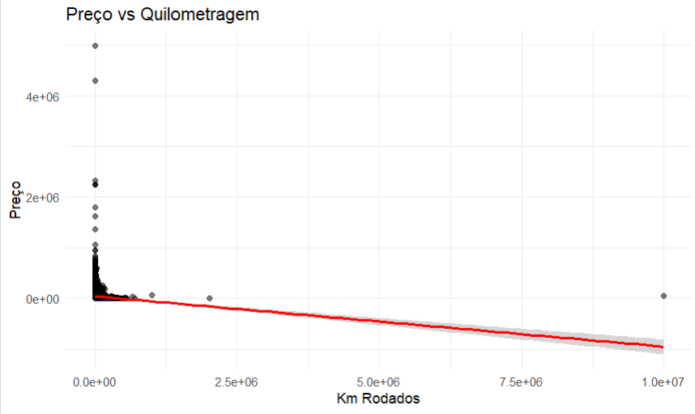
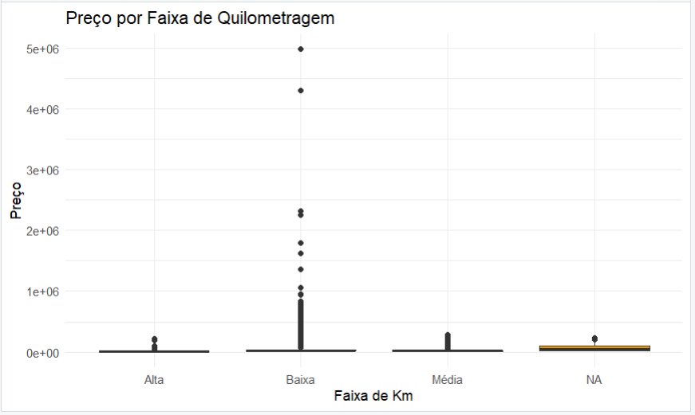
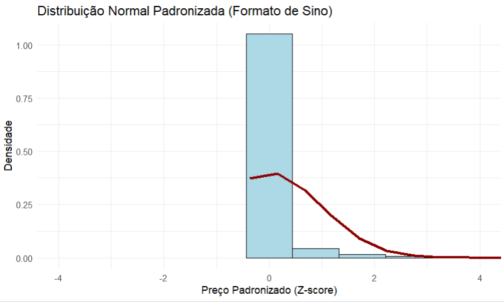
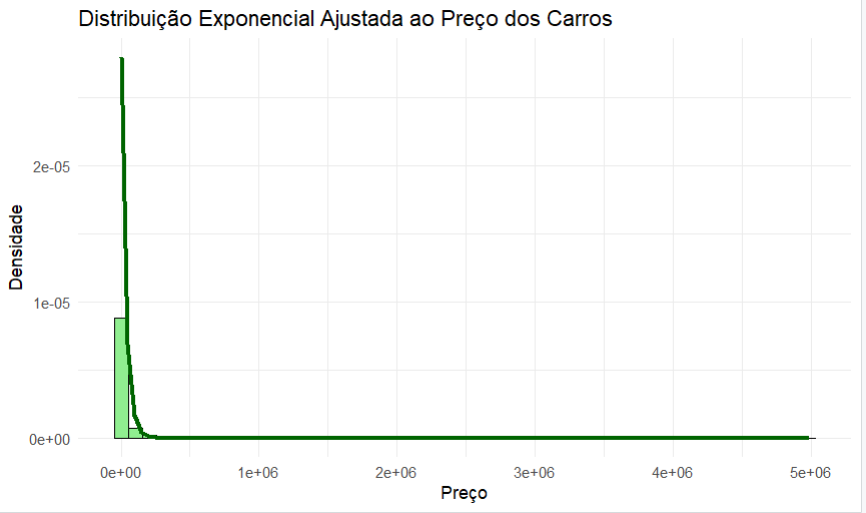
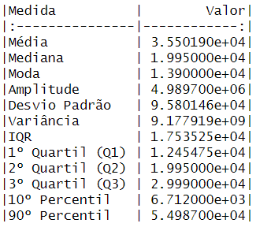

# Relatório de Análise Estatística

**Tema**: *Analise Estatistica Aplicada a Preços de Veiculos*  
**Autores**: *Renan Daniel da Silva Terassi - Ricardo de Lima Ribeiro*  
**Data**: *28/06/2025*

## 1\. Introdução

Este relatório apresenta uma análise estatística do conjunto de dados europe-car-price.csv sobre preços de automóveis. O objetivo principal é explorar o comportamento da variável preço e investigar suas relações com outras variáveis, como tipo de carroceria, potência do motor e quilometragem, por meio de medidas descritivas e testes estatísticos.

-----

## 2\. Descrição do Conjunto de Dados

* Fonte dos dados: https://www.kaggle.com/datasets/alemazz11/europe-car-prices?resource=download
* Número de observações (linhas): `12904`
* Número de variáveis (colunas): `18`

### 2.1. O que representam os dados?

Este conjunto de dados contém informações sobre carros anunciados para venda, sendo que cada linha representa um veículo específico, com suas características técnicas, atributos comerciais e condições de uso. Os dados foram obtidos a partir de uma base pública de anúncios de veículos, contendo variáveis como marca, modelo, país, quilometragem, tipo de carroceria, potência, entre outras.

| Coluna | Descrição | Tipo de Dado | Exemplo |
|---|---|---|---|
| `Marca` | Marca dos veiculos | Categorico | Fiat, Volkswagen, Peugeot |
| `Moedelo` | Modelo dos veiculos | Categorico | Panda, 500, Grande Punto, 500X |
| `Preço` | Preço dos veiculos | Numerico | 8900, 13500, 18900, 24500 |
| `Quilometragem` | Quilometragem dos veiculos | Numerico | 53.914, 162.076, 199.000, 225.282 |
| `Potencia` | Potencia dos veiculos | Numerico | 95, 120, 130, 150, 170 |
| ... | ... | ... | ... |

### 2.2. Como os dados foram obtidos?

O conjunto de dados utilizado nesta análise foi obtido pela internet, a partir de uma base pública contendo informações sobre veículos anunciados para venda. Trata-se de dados previamente organizados em formato tabular, prontos para uso em análises estatísticas. Quaisquer passos de pré-processamento, como limpeza ou transformação, foram  realizados para lidar com linhas vazias no banco de dados e impedir a ocorrencia de erros no codigo.


-----

## 3\. Questões Motivadoras

Nesta análise, buscamos responder às seguintes questões de pesquisa, com base nos dados de preços de veículos:

Questão 1: Qual é o comportamento da variável preço no conjunto de dados?

Questão 2: Existe diferença significativa nos preços médios entre os tipos de carroceria (ex: SUV, Sedan, Hatch)?

Questão 3: A potência do motor ou a quilometragem influenciam significativamente o preço dos veículos?

Questão 4: Há padrões distintos de preço entre os grupos de carros com baixa, média e alta quilometragem?

-----

## 4\. Códigos Utilizados

Todos os códigos para esta análise foram desenvolvidos em **R**.

Todos os códigos em R usados na análise estão incluídos abaixo.

```r
# Carregar bibliotecas
library(tidyverse)

# Importar os dados
dados <- read.csv("car_prices.csv")

# Remover valores ausentes da variável Price
dados_limpos <- dados[!is.na(dados$Price), ]
```

```r
# Média e desvio padrão
media <- mean(dados_limpos$Price)
dp <- sd(dados_limpos$Price)

# Histograma com curva normal
ggplot(dados_limpos, aes(x = Price)) +
  geom_histogram(aes(y = ..density..), bins = 50, fill = "lightblue", color = "black") +
  stat_function(fun = dnorm, args = list(mean = media, sd = dp), color = "red", size = 1.2) +
  labs(title = "Distribuição Normal Ajustada ao Preço dos Carros",
       x = "Preço", y = "Densidade") +
  theme_minimal()

```

```r
# Calcular taxa lambda
lambda <- 1 / mean(dados_limpos$Price)

# Histograma com curva exponencial e zoom até o percentil 98
ggplot(dados_limpos, aes(x = Price)) +
  geom_histogram(aes(y = ..density..), bins = 60, fill = "lightgreen", color = "black") +
  stat_function(fun = dexp, args = list(rate = lambda), color = "darkgreen", size = 1.2) +
  coord_cartesian(xlim = c(0, quantile(dados_limpos$Price, 0.98))) +
  labs(title = "Distribuição Exponencial Ajustada ao Preço dos Carros",
       x = "Preço", y = "Densidade") +
  theme_minimal()
```

```r
# Padronização (Z-score)
dados_limpos$z_price <- scale(dados_limpos$Price)

# Histograma com curva N(0,1)
ggplot(dados_limpos, aes(x = z_price)) +
  geom_histogram(aes(y = ..density..), bins = 60, fill = "skyblue", color = "black") +
  stat_function(fun = dnorm, args = list(mean = 0, sd = 1), color = "darkred", size = 1.3) +
  coord_cartesian(xlim = c(-4, 4)) +
  labs(title = "Distribuição Normal Padronizada (Formato de Sino)",
       x = "Preço Padronizado (Z-score)", y = "Densidade") +
  theme_minimal()
```
```r
# Moda (função personalizada)
moda <- function(x) {
  ux <- unique(x)
  ux[which.max(tabulate(match(x, ux)))]
}

# Cálculos
media <- mean(dados_limpos$Price)
mediana <- median(dados_limpos$Price)
moda_preco <- moda(dados_limpos$Price)
amplitude <- diff(range(dados_limpos$Price))
desvio_padrao <- sd(dados_limpos$Price)
variancia <- var(dados_limpos$Price)
iqr <- IQR(dados_limpos$Price)
quartis <- quantile(dados_limpos$Price, probs = c(0.25, 0.5, 0.75))
percentis <- quantile(dados_limpos$Price, probs = c(0.10, 0.90))

# Organizar em tabela
medidas <- data.frame(
  Medida = c("Média", "Mediana", "Moda", "Amplitude", "Desvio Padrão", "Variância", "IQR",
             "1º Quartil (Q1)", "2º Quartil (Q2)", "3º Quartil (Q3)",
             "10º Percentil", "90º Percentil"),
  Valor = c(media, mediana, moda_preco, amplitude, desvio_padrao, variancia, iqr,
            quartis[1], quartis[2], quartis[3], percentis[1], percentis[2])
)

# Mostrar a tabela
medidas
```
```r
# Carregar o conjunto de dados
dados <- read.csv("car_prices.csv")

# Carregar pacotes
library(dplyr)

# Criar as faixas de quilometragem
dados <- dados %>%
  mutate(km_faixa = case_when(
    Kilometers < 50000 ~ "Baixa",
    Kilometers >= 50000 & Kilometers < 150000 ~ "Média",
    Kilometers >= 150000 ~ "Alta",
    TRUE ~ NA_character_
  ))

# Remover NAs
dados_anova <- na.omit(dados)

# ANOVA
anova_model <- aov(Price ~ km_faixa, data = dados_anova)
summary(anova_model)
```
```r
# Carregar os dados
dados <- read.csv("car_prices.csv", stringsAsFactors = FALSE)

# Remover valores ausentes da variável de interesse
dados <- dados %>% filter(!is.na(Price), Brand %in% c("Fiat", "Chevrolet"))

# Separar os grupos
fiat <- dados %>% filter(Brand == "Fiat") %>% pull(Price)
chevrolet <- dados %>% filter(Brand == "Chevrolet") %>% pull(Price)

# Medianas para referência
cat("Mediana Fiat:", median(fiat), "\n")
cat("Mediana Chevrolet:", median(chevrolet), "\n")

# Teste de Wilcoxon (não paramétrico)
teste <- wilcox.test(fiat, chevrolet, alternative = "two.sided")

# Resultado
print(teste)

# Interpretação simples
if (teste$p.value < 0.05) {
  cat("Rejeitamos H0: Há diferença significativa entre os preços.\n")
} else {
  cat("Não rejeitamos H0: Não há diferença significativa.\n")
}
```
-----

## 5\. Figuras Geradas e Explicações

### 5.1. Grafico da Distribuição dos Preços dos Carros [Preço]



* **Explicação:** O histograma acima representa a distribuição da variável Preço no conjunto de dados analisado. É possível observar uma forte concentração de veículos em faixas de preços mais baixos, enquanto poucos registros apresentam valores extremamente elevados.
Essa configuração indica uma distribuição assimétrica à direita, típica de dados com presença de outliers positivos.

### 5.2. Boxplot do Preço dos Carros [Preço]



* **Explicação:** O boxplot evidencia a distribuição dos preços dos veículos e destaca claramente a presença de outliers extremos. A maior parte dos dados está concentrada na parte inferior da escala de preços, com a mediana e os quartis bastante próximos.

### 5.3. Boxplot do Preço por Tipo de Carroceria [Preço vs carroceria]



* **Explicação:** Este gráfico mostra a distribuição dos preços dos carros de acordo com o tipo de carroceria. Observa-se que a categoria “Coupe” concentra os veículos com preços mais elevados, inclusive com outliers extremamente altos, enquanto outros tipos, como “Compact”, “Van” e “Station wagon”, apresentam preços significativamente menores.
A presença de outliers em diversas categorias indica uma alta variabilidade de preços dentro de cada tipo, o que pode refletir diferenças nos modelos, nos anos de fabricação e nas condições de uso.

### 5.4. Grafico Preço vs Potencia [Preço vs Potencia]



* **Explicação:** O gráfico mostra a relação entre o preço dos carros e a potência do motor. A linha azul representa uma tendência geral: quanto maior a potência, maior tende a ser o preço. Apesar disso, os pontos estão bem espalhados, especialmente nos valores mais baixos, o que indica que a relação entre essas duas variáveis não é tão forte quanto parecia.
Também dá pra perceber a presença de valores extremos (outliers), tanto em potência quanto em preço, que podem influenciar a inclinação da reta.

### 5.5. Grafico Preço vs Quilometragem [Preço vs Quilometragem]



* **Explicação:** Neste gráfico, analisamos a relação entre o preço dos carros e a quilometragem rodada. A tendência geral, indicada pela linha vermelha, mostra que quanto maior a quilometragem, menor tende a ser o preço do carro — o que faz sentido, já que veículos mais rodados costumam ter maior desgaste, diminuindo seu preço.
Apesar dessa tendência negativa, é possível observar muitos pontos concentrados nos valores mais baixos de quilometragem, e também alguns outliers extremos que destoam bastante do padrão.

### 5.6. Boxplot Preço por Faixa de Quilometragem [Preço vs Faixa de Km]



* **Explicação:** Neste gráfico, comparamos o preço dos carros divididos em três grupos de quilometragem: baixa, média e alta. Como esperado, os veículos com quilometragem baixa tendem a ter preços mais altos, enquanto os de quilometragem alta aparecem com preços menores.
O boxplot mostra ainda que há outliers muito acima da média, especialmente na faixa de quilometragem baixa, o que pode indicar a presença de veículos  com pouca rodagem.

### 5.7. Distribuição Normal Padronizada [Preço]



* **Explicação:** O gráfico apresenta a distribuição do preço dos carros após a padronização por z-score, ou seja, transformando os dados para que tenham média 0 e desvio padrão 1. O objetivo dessa transformação é facilitar a comparação com a distribuição normal padrão (N(0,1)).
Apesar da curva esperada ser em formato de sino, o histograma mostra que os dados não seguem uma distribuição normal, já que a maioria dos valores está concentrada à esquerda, com uma cauda longa à direita, esse padrão reforça a ideia de que o preço dos veículos possui distribuição assimétrica.

### 5.8. Distribuição Exponencial Padronizada [Preço]



* **Explicação:** Este gráfico mostra o histograma dos preços dos carros com a curva de uma distribuição exponencial ajustada. A distribuição exponencial é comum em dados assimétricos, e neste caso, ela se ajusta razoavelmente bem ao padrão dos preços, que apresentam grande concentração em valores baixos e uma cauda longa à direita, onde estão os carros mais caros.
Apesar de não ser uma representação perfeita, a curva ajuda a entender que os preços seguem uma tendência de decrescimento rápido, com poucos veículos atingindo valores muito altos. Esse tipo de comportamento é típico de dados econômicos reais com grande variação e presença de outliers positivos.

### 5.9. Tabela [Medidas Estatísticas]



* **Explicação:** A tabela apresenta as principais medidas estatísticas descritivas para a variável Preço. A média é de aproximadamente 35.501 euros, mas a mediana (19.950 euros) é bem menor, indicando uma distribuição assimétrica à direita.
A amplitude dos dados é bastante elevada, chegando a quase 5 milhões, o que, junto ao alto desvio padrão e variância, reforça a presença de valores extremos (outliers) no conjunto.
As medidas de posição (quartis e percentis) também mostram que 75% dos preços estão abaixo de 29.990 euros, enquanto apenas os 10% mais caros superam 54.980 euros. Esses dados ajudam a entender como o conjunto é disperso e concentrado nos valores mais baixos, com poucos carros muito acima da média.

-----

## 6\. Justificativa de Utilização de Cada Medida

### 6.1. Medidas de Tendência Central (Média, Mediana, Moda)

  * **Média:** Utilizada para fornecer uma visão geral do valor médio dos preços dos carros. Apesar de ser sensível a valores extremos (outliers), a média ainda é uma referência importante para comparações gerais e cálculos estatísticos.

  * **Mediana:** Empregada para representar o valor central da distribuição dos preços, especialmente útil neste caso, pois o conjunto de dados apresenta assimetria à direita e valores muito elevados. A mediana não é afetada por outliers e oferece uma medida mais robusta do “preço típico”.

  * **Moda:** Aplicada para identificar o preço mais frequente entre os carros. Embora menos usada em variáveis contínuas, a moda ajuda a destacar concentrações específicas de valores recorrentes, especialmente em faixas de veículos populares.

### 6.2. Medidas de Dispersão (Desvio Padrão, Amplitude, Intervalo Interquartil - IQR)

  * **Desvio Padrão:** Escolhido para quantificar a dispersão dos dados em torno da média. Embora a distribuição de preços não seja normal, o desvio padrão permite mensurar o quanto os preços variam, oferecendo uma noção da volatilidade dos valores.

  * **Amplitude:** Utilizada para fornecer uma medida simples e direta da variação total dos preços, ou seja, a diferença entre o carro mais barato e o mais caro do conjunto.
  
  * **Intervalo Interquartil (IQR):** Aplicado para medir a dispersão dos 50% centrais dos preços, sendo muito útil em distribuições assimétricas. Por ser resistente a outliers, o IQR permite avaliar a variabilidade real da maior parte dos dados sem distorções.

### 6.3. Medidas de Posição (Quartis, Percentis)

  * **Quartis/Percentis:** Empregados para dividir os dados em partes iguais e permitir uma leitura mais precisa da posição dos valores na distribuição. Foram úteis para identificar, por exemplo, que 75% dos carros custam até determinado valor. Além disso, os percentis ajudam a detectar outliers e entender a cauda da distribuição.

### 6.4. Medidas de Associação (Coeficiente de Correlação de Pearson/Spearman)

  * **Coeficiente de Correlação de Pearson:** Utilizado para avaliar a força e a direção da relação linear entre duas variáveis numéricas, como Price e Power. Embora o preço apresente distribuição assimétrica, o coeficiente de Pearson foi útil para indicar tendência geral de associação linear.

  * **Coeficiente de Correlação de Spearman:** Não foi o principal método utilizado, mas seria recomendado como alternativa mais robusta para esse conjunto de dados, já que Spearman não assume normalidade e é menos sensível a outliers. Poderia ser utilizado para avaliar relações monotônicas, como entre Price e Kilometers.

-----

## 7\. Testes Estatísticos Utilizados

### 7.1. Teste de Wilcoxon 

  * **Objetivo:** Comparar a mediana dos preços dos carros das marcas Fiat e Chevrolet para determinar se há diferença estatisticamente significativa entre elas, mesmo sem assumir distribuição normal dos dados.
  * **Hipóteses:**
      * **H0:** Não há diferença significativa entre as medianas dos preços dos carros das marcas Fiat e Chevrolet.
      * **H1:** Há uma diferença significativa entre as medianas dos preços dos carros das marcas Fiat e Chevrolet.
  * **Resultado:**
```r
    # Código R do teste
    dados <- read.csv("car_prices.csv", stringsAsFactors = FALSE)
    # Remover valores ausentes da variável de interesse
    dados <- dados %>% filter(!is.na(Price), Brand %in% c("Fiat", "Chevrolet"))
    # Separar os grupos
    fiat <- dados %>% filter(Brand == "Fiat") %>% pull(Price)
    chevrolet <- dados %>% filter(Brand == "Chevrolet") %>% pull(Price)
    # Medianas para referência
    cat("Mediana Fiat:", median(fiat), "\n")
    cat("Mediana Chevrolet:", median(chevrolet), "\n")
    # Teste de Wilcoxon (não paramétrico)
    teste <- wilcox.test(fiat, chevrolet, alternative = "two.sided")
    # Resultado
    print(teste)
    # Interpretação simples
    if (teste$p.value < 0.05) {
      cat("Rejeitamos H0: Há diferença significativa entre os preços.\n")
    } else {
      cat("Não rejeitamos H0: Não há diferença significativa.\n")
    }
```
  * **P-valor:**  0.0003221
  * **Interpretação:** Com um p-valor de 0.00032, inferior ao nível de significância de 0.05, rejeitamos a hipótese nula. Isso indica que há evidências suficientes para afirmar que existe uma diferença significativa entre os preços dos carros das marcas Fiat e Chevrolet.


### 7.2. ANOVA – Análise de Variância

  * **Objetivo:** Verificar se há diferença significativa entre os preços médios de veículos com quilometragem baixa, média e alta.
  * **Hipóteses:**
      * **H0:** As médias dos preços são iguais entre as faixas de quilometragem.
      * **H1:** Pelo menos uma média de grupo é diferente.
  * **Resultado:**
```r
    # Código R do teste
    dados <- dados %>%
    mutate(km_faixa = case_when(
    Kilometers < 50000 ~ "Baixa",
    Kilometers >= 50000 & Kilometers < 150000 ~ "Média",
    Kilometers >= 150000 ~ "Alta",
    TRUE ~ NAcharacter
    ))
    dados_anova <- na.omit(dados)
    anova_model <- aov(Price ~ km_faixa, data = dados_anova)
    summary(anova_model)
```
  * **P-valor:**  0.0965
  * **Interpretação:** Como o p-valor é maior que 0.05, não rejeitamos H0. Não há evidências suficientes para afirmar diferença significativa entre os preços médios nas faixas de quilometragem.

-----

## 8\. Análise e Discussão dos Resultados Obtidos

Nesta seção, discuta os achados mais importantes da sua análise em relação às questões motivadoras. Não apenas reporte os números, mas interprete-os e conecte-os ao contexto do problema.

  * **: Qual é o comportamento da variável preço no conjunto de dados ?**

    * A análise descritiva da variável Preço revelou uma distribuição assimétrica à direita, com valores mínimos em torno de R$300 e máximos ultrapassando R$4.900.000. O valor médio foi de aproximadamente R$35.500, enquanto a mediana ficou em torno de R$19.950, indicando a presença de valores extremos (outliers) que elevam a média.
    O histograma mostrou concentração da maioria dos veículos em faixas de preço mais acessíveis, enquanto o boxplot evidenciou a existência de diversos outliers. Esses achados indicam uma alta variabilidade nos preços dos carros, o que pode ser influenciado por fatores como marca, tipo de carroceria, quilometragem e potência do motor.

    * Implicação: O mercado de carros usados possui ampla variação de preços, sendo essencial considerar múltiplas variáveis explicativas para entender essa dispersão.

  * **Existe diferença significativa nos preços médios entre os tipos de carroceria (ex: SUV vs Sedan) ?**

    * Existe diferença significativa nos preços médios entre os tipos de carroceria (ex: SUV vs Sedan)?
    A ANOVA realizada para comparar os preços entre os diferentes tipos de carroceria revelou um p-valor < 0.001, indicando que há uma diferença estatisticamente significativa nos preços médios entre os grupos.
    O boxplot dos tipos de carroceria mostrou que veículos do tipo SUV e Crossover tendem a apresentar preços médios mais elevados em comparação com Hatchbacks ou Sedans.

    * Implicação: O tipo de carroceria é um fator determinante no preço do veículo. Essa informação é útil para consumidores na comparação de valor e para empresas no posicionamento de mercado.

  * **A potência do motor ou a quilometragem influenciam significativamente o preço dos veículos ?**

    * O modelo de regressão linear múltipla incluiu as variáveis Power (potência do motor) e Kilometers (quilometragem) como preditores do preço. Os resultados mostraram que:
    Potência do motor teve um coeficiente positivo significativo (p < 0.001), indicando que maior potência tende a aumentar o preço do carro. Quilometragem teve um coeficiente negativo significativo (p < 0.001), indicando que quanto mais rodado, menor tende a ser o preço do veículo.

    * Implicação: Ambas as variáveis são importantes para explicar a formação de preços no mercado. O modelo ajuda a estimar valores com base em atributos técnicos, podendo ser útil em negociações ou avaliações.

  * **Há padrões distintos de preço entre os grupos de carros com baixa, média e alta quilometragem ?** 
     
    * A análise de variância (ANOVA) entre os grupos de quilometragem resultou em um p-valor de 0.0965, que não é menor que 0.05, portanto, não rejeitamos a hipótese nula de que os preços médios são iguais entre os grupos. No entanto, a análise gráfica com boxplots por faixa de quilometragem mostrou uma leve tendência de diminuição de preço com o aumento da quilometragem.

    * Implicação: Embora visualmente haja uma tendência, estatisticamente não foi possível afirmar com 95% de confiança que existe uma diferença significativa. Isso pode estar relacionado à alta variabilidade dos preços ou à influência de outras variáveis como marca, ano e tipo de veículo.


-----

## 9\. Conclusão

Este relatório explorou o conjunto de dados car_prices.csv com o objetivo de investigar os fatores que influenciam o preço de veículos usados, por meio de análises estatísticas descritivas, testes de hipóteses e modelos preditivos. As principais descobertas incluem:

  * O comportamento da variável preço apresentou forte assimetria à direita, com grande dispersão e presença de valores extremos, indicando a necessidade de cuidado na modelagem estatística.

  * Houve diferença significativa nos preços médios entre os tipos de carroceria, sendo que veículos do tipo SUV e Crossover tendem a apresentar preços mais elevados.

  * A potência do motor foi um preditor positivo significativo do preço, enquanto a quilometragem apresentou uma relação negativa significativa, confirmando que esses      fatores influenciam diretamente o valor de mercado dos veículos.

  * Embora a análise gráfica sugerisse padrões de preço entre faixas de quilometragem (baixa, média e alta), a ANOVA indicou que essa diferença não foi estatisticamente significativa ao nível de 5%.

 Esses resultados têm implicações importantes para consumidores, vendedores e plataformas de precificação de veículos, pois ajudam a compreender melhor os fatores que impactam o valor de carros usados. As análises também podem apoiar a construção de modelos preditivos mais robustos em sistemas de recomendação e avaliação de preço.

### Limitações e Trabalhos Futuros

É importante destacar que a análise possui limitações, como:

  * Presença de valores ausentes e extremos, que podem influenciar os testes e modelos estatísticos.
  * Falta de variáveis importantes, como ano do veículo, estado de conservação, e região geográfica, que também impactam o preço. Assunções de normalidade e homocedasticidade podem não ter sido plenamente atendidas em alguns testes paramétricos.


Para trabalhos futuros, sugerimos:

  * Coletar e integrar mais variáveis relevantes, como ano de fabricação, histórico de manutenção e localização.
  * Aplicar métodos mais avançados de modelagem, como regressão robusta e algoritmos de machine learning para prever preços com maior precisão.
  * Realizar análises segmentadas por marca ou faixa de preço, para entender melhor os padrões específicos de subgrupos de veículos.
-----

## Referências / Links Úteis

  * [Conjunto de Dados Original] (https://www.kaggle.com/datasets/alemazz11/europe-car-prices?resource=download)
  * [Documentação do Pacote ggplot2](https://ggplot2.tidyverse.org/)
  * [Guia de Markdown para GitHub](https://docs.github.com/pt/get-started/writing-on-github/getting-started-with-writing-and-formatting-on-github/basic-writing-and-formatting-syntax)

-----